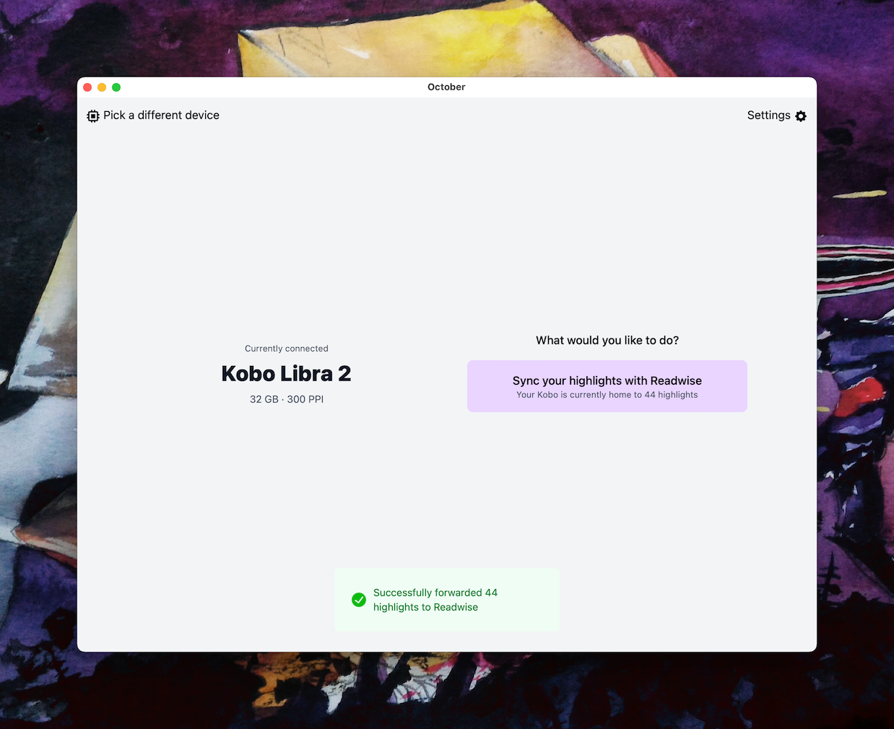

  

# October
> Easily submit your Kobo highlights to Readwise (and eventually more)

## What is October?

A small [Wails](https://github.com/wailsapp/wails) application for syncing your highlights with [Readwise](https://readwise.io).

Kobo eReaders are somewhat notorious for not being user friendly to extract highlights off of. Personally I only send mine to Readwise anyway so this tool does just that in as little as two clicks.

Eventually, if I get around to it, I plan to allow exporting your Kobo database to disc and to various formats if that's useful.

For now, I just use the Readwise functionality the most.

## Early access

While the first release is published, and visually it's fairly polished, the codebase is a bit messier than I'd like.

To reflect that, I haven't published v1.0.0 just yet but it's good enough to use (and I do use it regularly) so feel free to file any issues you run into.

You can track the progress towards v1.0.0 [here](https://github.com/marcus-crane/october/milestone/1).

## Installation

For now, the installation process is pretty barebones. You can find a range of releases under the [releases](https://github.com/marcus-crane/october/releases) tab.

### macOS

For macOS, both platform specific (Intel and macOS Silicon) builds are available as well as a slightly larger [Universal binaries](https://developer.apple.com/documentation/apple-silicon/building-a-universal-macos-binary). If in doubt, just pick the universal `dmg` but if you prefer, you can save a bit of space with a platform specific build.

It's also worth nothing that the mac apps are notarised with my developer certificate so you shouldn't have to go through the quarantine process anymore.

### Windows

For Windows, an `amd64` (`x86`/Intel) build is available which most will be what most Windows users will want to use. An `arm64` build is available as well although I don't know that anyone really uses Windows ARM but it's cheap to compile.

You'll also need to allow [Microsoft Edge WebView 2](https://docs.microsoft.com/en-us/microsoft-edge/webview2/) to be installed. You don't have to do anything additional, October will prompt you to install it the first time you start up October.

### Linux

For Linux users, [Wails](https://wails.io) has just merged Linux support into the main branch which I plan to test out in a bit. Hopefully Linux builds should be supported soon and my intention is that they'll be available by the time a proper `v1.0.0` ships.

## Usage

The scope of October is pretty small.

To get started, you'll need to get your Readwise access token from [https://readwise.io/access_token](https://readwise.io/access_token).

Once you've done that, navigate to the Settings page (after selecting your Kobo), save it once and then navigate back to Overview to use the sync functionality.

Your token will be saved locally so you only need to provide it once.

## Kobo Support

Under the hood, I use pgaskin's [koboutils](https://github.com/pgaskin/koboutils) library.

It doesn't support the Sage, Libra 2 or Elipsa however so I've hacked in support temporarily as I got a Libra 2 recently.

It should all work the same but buyer beware and all that. October never writes to your Kobo, just reads so you should be perfectly safe.

## Issues

If you're running into issues, feel free to open a Github issue although support is best effort.

For specific issues, I'll likely ask for a copy of your logs to help with debugging.

October saves logs in the following places:

* Windows: `C:\Users\<username>\AppData\Local\october\logs`
* macOS: `$HOME/Library/Application Support/october/logs`

Given that, if you do have custom XDG locations, October should honour them out of the box.

## Screenshots

### macOS

Device selection

Device overview

Device settings

### Windows

Device selection

Device overview

Device settings

## Support

Found October useful? Like most organisms, I have a crippling addition.

Actually, that's not true! I think coffee is overrated but I still enjoy the taste which a lot of people find odd.

Anyway, it's up to you. October will always be open source and never monetised but the social validation gets me going :)

There are some links in the sidebar you can use.

## Special thanks

### Wails

First and foremost, this project only lives thanks to the continuing efforts of [Lea Anthony](https://twitter.com/leaanthonycymru) and the [Wails](https://wails.io) project.

The first iteration of this project died (of author burnout) from battling too much with [Electron](https://www.electronjs.org/), getting it to integrate nicely with sqlite3 libraries and while trying to adhere to the security model.

In comparison, Wails (especially v2!) has been a lot more fun and gave this project a second life.

With stumbling across it, I probably would've given up entirely!

### Logo

Base assets:

- Octopus and glasses icons from Google's [Noto Emoji](https://github.com/googlefonts/noto-emoji/) project
  - Used under the SIL Open Font License, visible under [assets/LICENSE](assets/LICENSE)
  - Mashup generated by Google Keyboard's [Emoji Kitchen](https://blog.google/products/android/emoji-kitchen-new-mashups-mixing-experience/)
  - The end result does not directly use images from the `noto-emoji` repo but does indirectly through Google Keyboard, so the SIL Open Font License is understood to still apply.
- Book image from [Merlin2525](http://www.freestockphotos.biz/stockphoto/14305)
  - Base image released under [Public Domain](https://creativecommons.org/publicdomain/zero/1.0/) by author and colour swapped from red to blue
- Final logo compiled from the above assets by The Oligopolist.
  - As a derivation of assets released under the SIL Open Font License, the same license still applies to the end result.
