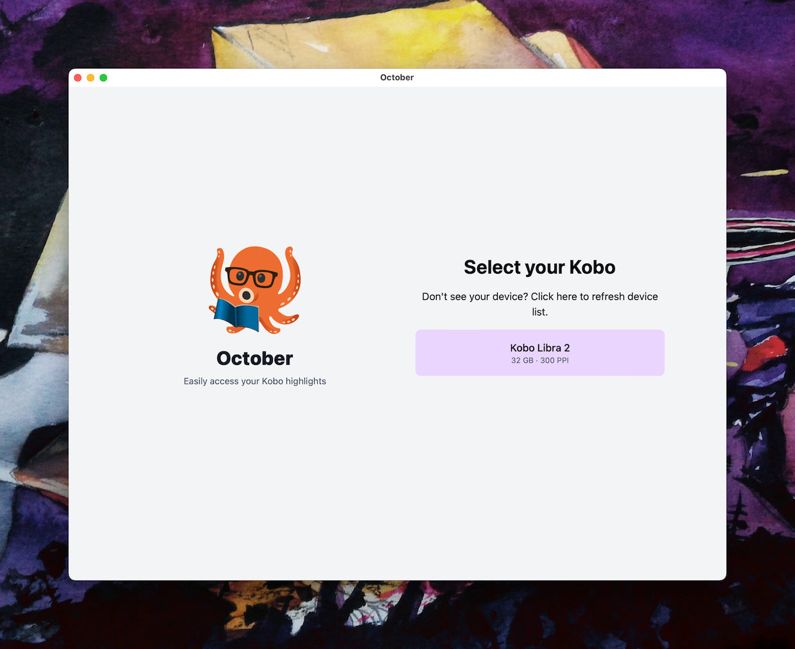

  

# October
> Easily submit your Kobo highlights to Readwise (and eventually more)

## What is October?

A small [Wails](https://github.com/wailsapp/wails) application for syncing your highlights with [Readwise](https://readwise.io).

Kobo eReaders are somewhat notorious for not being user friendly to extract highlights off of. Personally I only send mine to Readwise anyway so this tool does just that in as little as two clicks.

Eventually, if I get around to it, I plan to allow exporting your Kobo database to disc and to various formats if that's useful.

For now, I just use the Readwise functionality the most.

## Early access

While the first release is published, and visually it's fairly polished, the codebase is a bit messier than I'd like.

To reflect that, I haven't published v1.0.0 just yet but it's good enough to use (and I do use it regularly) so feel free to file any issues you run into.

## Installation

For now, the installation process is pretty barebones. You can find two macOS `.app` files zipped up, one for Intel machines and one for Apple Silicon.

If you use an Intel machine, you'll want the `amd64` zip file. If you use an Apple Silicon / M1 machine, you'll want the `arm64` zip file.

You'll also need to refer to the [Quarantine](#quarantine) step to allow the application to run initially if you're not already familiar.

A Windows build is possible, and will likely be uploaded shortly. I just need to actually find a Windows machine to test on but it should work all the same.

Feel free to file an issue if you'd like to see a Windows build and I can prioritise it.

For Linux users, [Wails](https://wails.io) is almost at the point of releasing Linux beta support so a Linux build should be possible soon but again, I need to set up a Linux distro to test it.

## Quarantine

October isn't signed with a developer certificate (yet) so when running it for the first time, you'll see a popup like this:

You'll need to click "Cancel" and then go to System Preferences -> Security and Privacy in order to allow October to run

## Usage

The scope of October is pretty small.

To get started, you'll need to get your Readwise access token from [https://readwise.io/access_token](https://readwise.io/access_token).

Once you've done that, navigate to the Settings page (after selecting your Kobo), save it once and then navigate back to Overview to use the sync functionality.

Your token will be saved locally so you only need to provide it once.

## Kobo Support

Under the hood, I use pgaskin's [koboutils](https://github.com/pgaskin/koboutils) library.

It doesn't support the Sage, Libra 2 or Elipsa however so I've hacked in support temporarily as I got a Libra 2 recently.

It should all work the same but buyer beware and all that. October never writes to your Kobo, just reads so you should be perfectly safe.

## Screenshots

Device selection

Device overview

Device overview

## Special thanks

### Wails

First and foremost, this project only lives thanks to the continuing efforts of [Lea Anthony](https://twitter.com/leaanthonycymru) and the [Wails](https://wails.io) project.

The first iteration of this project died (of author burnout) from battling too much with [Electron](https://www.electronjs.org/), getting it to integrate nicely with sqlite3 libraries and while trying to adhere to the security model.

In comparison, Wails (especially v2!) has been a lot more fun and gave this project a second life.

With stumbling across it, I probably would've given up entirely!

### Logo

Base assets:

- Octopus and glasses icons from Google's [Noto Emoji](https://github.com/googlefonts/noto-emoji/) project
  - Used under the SIL Open Font License, visible under [assets/LICENSE](assets/LICENSE)
  - Mashup generated by Google Keyboard's [Emoji Kitchen](https://blog.google/products/android/emoji-kitchen-new-mashups-mixing-experience/)
  - The end result does not directly use images from the `noto-emoji` repo but does indirectly through Google Keyboard, so the SIL Open Font License is understood to still apply.
- Book image from [Merlin2525](http://www.freestockphotos.biz/stockphoto/14305)
  - Base image released under [Public Domain](https://creativecommons.org/publicdomain/zero/1.0/) by author and colour swapped from red to blue
- Final logo compiled from the above assets by The Oligopolist.
  - As a derivation of assets released under the SIL Open Font License, the same license still applies to the end result.
