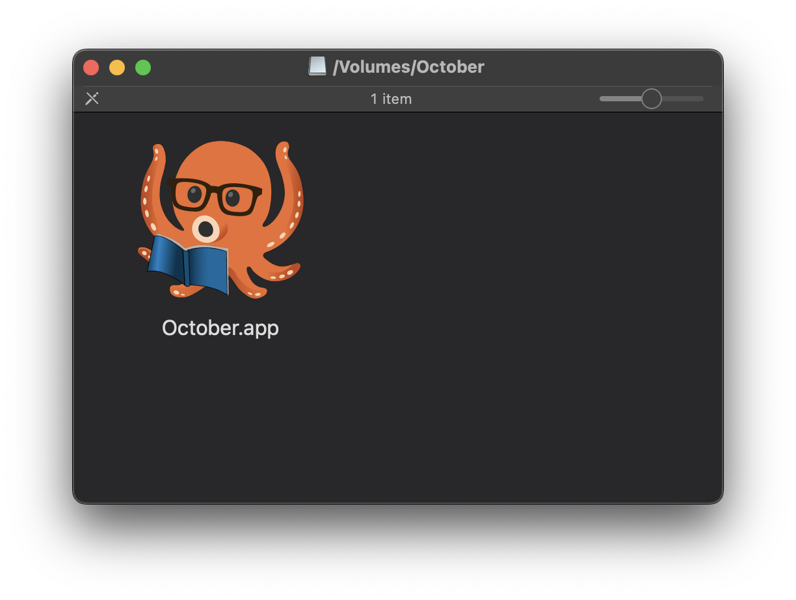

# macOS

For macOS users, there are three builds available:

- amd64 (Intel)
- arm64 (Apple Silicon)
- Universal (Both)

There is functionally no difference between the universal build and a platform specific build, aside from the filesize being doubled.

If you're not sure which platform you're on, just pick the universal build. The file size difference is 5 megabytes so it's not going to make or break your hard drive by any means.

## Installation

For experienced macOS users, there's nothing special in the setup process. It's a standard DMG so if you're familiar, feel free to skip this section.

For those who are less familiar with the platform, you'll first want to download your build of choice, or if you're still unused, [the universal build](https://october.utf9k.net/download/mac/latest) is guaranteed to work.

Once downloaded, you should have a zip folder in `~/Downloads` like so:

Double click on this zip file to automatically extract the contents and you'll now have a second file ending in `.dmg` like so:

You should now see a small window pop up with an icon for October

Behind this popup, you should still have your Finder window open in the background.

Jump back to it and navigate to `Applications` which should be an option in the sidebar by default.

From here, you'll want to drag `October.app` (from the small popup window) into your Applications folder like so:

You'll know it's right once you get a blue border around your Applications pane like in the screenshot which is your cue to let go.

Scrolling down, you should now see it installed.

That's it! You can either double click on the entry in `Applications` or search for October using your search tool of choice (ie; Spotlight, Alfred, Raycast etc)

You can bring up Spotlight by default with <kbd>Command</kbd> + <kbd>Space</kbd> or click the magnifying glass on the right side of your menu bar, at the top of the screen.

## Technical Details

If you're curious about any files that are generated or need to manually wipe October from existence, here are the following places that files are created:

### Application

The main October app lives at `/Applications/October.app` and is self contained as far as the shipped binary is concerned.

You can right click on it and select `Show Package Contents` to poke around if you like.

Uninstalling is the standard macOS fare of dragging `October.app` into the trash can.

### Logs

These are stored at `$HOME/Library/Application Support/october/logs` with one log file created each time the application is launched.

Logs are in [ndjson](http://ndjson.org/) format and use the naming convention of `<current unix timestamp>.json`.

### Settings

October's internal settings are stored in a JSON file that lives at `$HOME/Library/Application Support/october/config.json`.